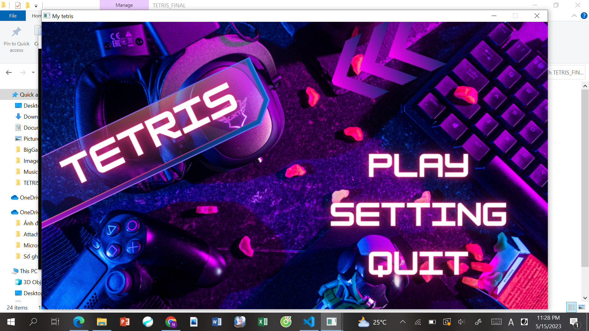
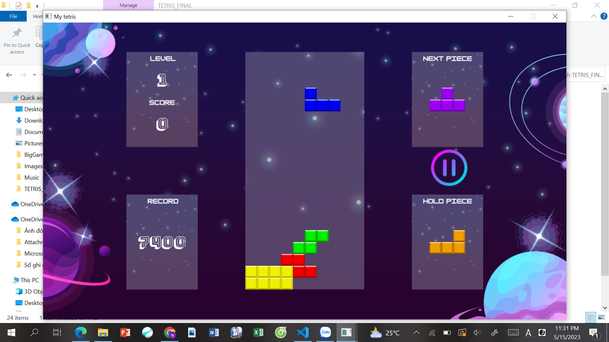

#TETRIS SDL2
> Bài tập môn LTNC INT2215 1 Nhóm 6
> Khuất Bảo Nguyên - MSV: 22026508

##Cài đặt
> - Clone folder git về
> - Cài đặt thư viện SDL2 và VS Code để chạy file main.exe và chơi

##Ý tưởng/Mô tả trò chơi
###1. Giới thiệu
- Tetris là trò chơi xếp các khối gạch, người chơi sẽ cố gắng xếp đầy các viên gạch vào 1 hàng để xóa chúng đi.
- Trò chơi không hẳn có thắng thua mà chỉ tính điểm của người chơi, khi game over sẽ hiện điểm người chơi.
###2. Cách chơi
- Mục tiêu của trò chơi là di chuyển các khối gạch đang rơi từ từ xuống trong kích thước hình chữ nhật 20 hàng x 10 cột (trên màn hình). Chỗ nào có gạch rồi thì không di chuyển được tới vị trí đó. Người chơi xếp những khối hình sao cho khối hình lấp đầy 1 hàng ngang để ghi điểm và hàng ngang ấy sẽ biến mất.
- Nếu để cho những khối hình cao quá màn hình, trò chơi sẽ kết thúc.
- Trò chơi kết thúc khi khối gạch không rơi xuống được nữa.
- Tất cả các Tetriminos có khả năng hoàn thành một và hai dòng. J, L có thể có ba. Chỉ có Tetrimino chữ I có khả năng để xóa bốn dòng cùng một lúc, và điều này được gọi là một "Tetris". Xóa nhiều nhất chỉ được 4 hàng/1 lần.
###3. Phím tắt
- Xoay khối: phím mũi tên lên ↑.
- Di chuyển sang phải: phím mũi tên phải →.
- Di chuyển sang trái: phím mũi tên trái ←.
- Làm cho khối gạch rơi nhanh hơn: phím mũi tên xuống ↓.
- Giữ 1 khối gạch để dùng sau: phím Space.
- ***Hard Drop*** - khối gạch rơi xuống ngay lập tức: phím Enter

***Hình ảnh minh họa***

##Lý do chọn game

Là một học sinh chuyên Anh hồi cấp 3 và không có một chút nền tảng về lập trình, lý do em chọn Tetris đơn giản là vì đây là một game kinh điển và có nhiều tutorial để tham khảo trong quá trình làm ạ.

##Các chức năng chính

###1. Logic Game
- Xóa các khối sau khi đã xếp đầy 1 dòng.
- Xoay các khối hình.
- Dự đoán khối gạch tiếp theo.
- Giữ khối gạch.
- Có nhiều level (tính theo tốc độ rơi của khối gạch).
- Tính và lưu điểm cao nhất.

###2. Hiệu ứng âm thanh, hình ảnh

- Âm thanh:
> Có nhạc nền, hiệu ứng âm thanh di chuyển, xoay khối, xóa hàng, khối gạch rơi và khi game over.
- Hình ảnh:
> Có thời gian dừng khi xóa dòng, chuyển giữa 1 số trạng thái, có thể coi là hiệu ứng. 
> 
> Đặc biệt, em tự nhận thấy các hình ảnh trong game của mình được design một cách chỉn chu, bắt mắt, có sự đầu tư và tạo hứng thú cho người chơi.

###3. Một số tính năng khác

- Menu chỉn chu: có nút Play, Setting (Bật tắt âm nhạc, hiệu ứng âm thanh, chỉnh level cho game), có nút quit.
- Có thể pause game khi đang chơi: Có thể resume game, chơi lại, chỉnh âm thanh, âm nhạc, quay về trang menu chính.
- Render điểm sau khi hoàn thành ván chơi, lưu và render điểm cao nhất khi đang chơi.

##Các kỹ thuật sử dụng
- Render hình ảnh, phát âm thanh, quản lý chuột, bàn phím, thời gian (SDL)
- Sử dụng class, pointer, random, mảng ...
- Phân chia các object thành từng file để dàng vận hành và quản lý
- Thuật toán xoay khối gạch, xử lý va chạm,...

###Đề xuất hướng phát triển tiếp theo
- Phân chia lại các file một cách hợp lý hơn.
- Có thể code thêm tính năng Battle (2 người chơi), chơi với máy, cho máy tự chơi.
- Làm nhiều stage hình ảnh, cải tiến về mặt hình ảnh.

###Tài liệu tham khảo:
- [Lazyfoo](https://lazyfoo.net/): SDL2 Tutorial
- [Video tutorial hướng dẫn làm game Tetris](https://- www.youtube.com/watch?v=kh3rkt6nZ2c&t=5883s): Em tham khảo các thuật toán chính về logic game ở đây và các source code github về tetris
- Nguồn hình ảnh: Em des ở Canva và lấy các icon từ [flaticon](https://www.flaticon.com/)
- Âm thanh: Em lấy nhạc từ [Youtube](https://www.youtube.com/?gl=VN) và sound effects từ nhiều nguồn trên mạng.